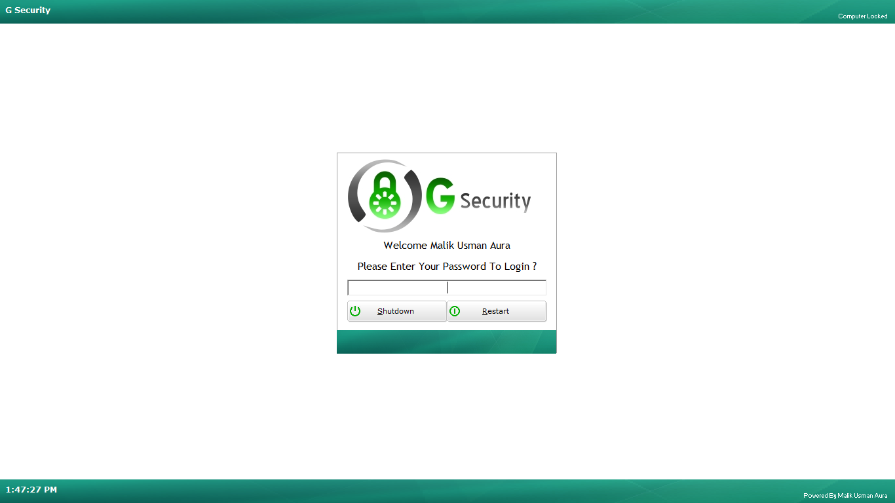
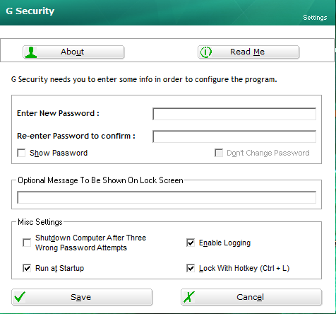
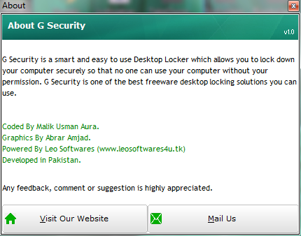
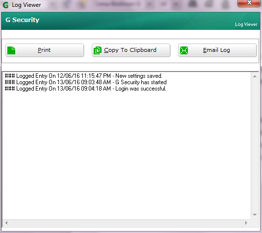

---
# You don't need to edit this file, it's empty on purpose.
# Edit theme's home layout instead if you wanna make some changes
# See: https://jekyllrb.com/docs/themes/#overriding-theme-defaults
layout: default
permalink: /
image: /img/parallax1.jpg
main_title: "G Security Desktop Locker"
sub_title: "Freeware Desktop Locker For Windows"
downloads: false
---

	

		<h2 class="w3-center w3-wide w3-text-light-gray w3-padding"><i class="fa fa-question-circle-o fa-fw fa-4x w3-text-light-gray w3-hover-opacity-off"></i>  What is G Security? </h2>
		

			

				

					
<i class="fa fa-shield fa-4x"></i>

				

				<footer class="w3-container">Secure Desktop Locker</footer>
			

			

				

					
<i class="fa fa-windows fa-4x"></i>

				

				<footer class="w3-container">Built for Windows</footer>
			

			

				

					
<i class="fa fa-compress fa-4x"></i>

				

				<footer class="w3-container">Small Size and Low Impact on System Resources</footer>
			

		

		

			

				

					
<i class="fa fa-fighter-jet fa-4x"></i>

				

				<footer class="w3-container">Programmed for Performance</footer>
			

			

				

					
<i class="fa fa-credit-card fa-4x"></i>

				

				<footer class="w3-container">Freeware</footer>
			

			

				

					
<i class="fa fa-code fa-4x"></i>

				

				<footer class="w3-container">Coded in Visual Basic</footer>
			

		

		

			G Security is an easy to use Desktop locker/Screen locker developed for Microsoft Windows. 
			It allows a user to securely lock down Windows in such a way that it cannot be accessed by an unauthorized user. 
			G Security is light weight and easy to use with a highly user friendly interface. 
			It prevents anyone from accessing your computer when it's locked down so that your private data stored on the computer cannot be accessed by anyone. 
			It completely locks down your computer so that even if someone gets a hold of your computer, he or she can do nothing on it. 
			It can lock down your computer on start up as well as any time you want just by pressing some keys. 
			Once the computer is locked down shortcut keys like Alt+tab, Ctrl+Alt+Esc, Alt+F4 etc. will not work at all. 
			The Ctrl+Alt+Del screen will also be secured in such a way that no one can unlock your computer without correct password. 
			Any running application will also be prevented from messing up with the locked computer. 
			It can be used by multiple users at a time on a single computer with the settings stored for each user individually so that each user can use G Security with its own preferences. 
			G Security also supports hotkey to lock the system. In a few words its extremely secure, easy to use and configurable desktop locking solution available for everyone free of cost.
		

	

	

		<h2 class="w3-wide w3-padding">
			<i class="fa fa-picture-o fa-fw fa-4x w3-hover-opacity-off"></i> 
			Screenshots
		</h2>
		

			
 &nbsp; 

			

				

					
					

						<h4>G Security Lock Screen</h4>
					

				

			

			

				

					
					

						<h4>Settings Window</h4>
					

				

			

		

		

			
 &nbsp; 

			

				

					
					

						<h4>About Window</h4>
					

				

			

			

				

					
					

						<h4>Log Viewer</h4>
					

				

			

		

	

	

		<h2 class="w3-center w3-wide w3-text-light-gray w3-padding">
			<i class="fa fa-trophy fa-fw fa-4x w3-text-light-gray w3-hover-opacity-off"></i> 
			Awards Won By G Security 
		</h2>
		

			

				
				

					<h4>100% Clean Award By Softpedia</h4>
				

			

		

		

			

				
				

					<h4>100% Clean Award By Majorgeeks.com</h4>
				

			

		

		

			

				
				

					<h4>Converter-Soft 5 Star Award</h4>
				

			

		

	

